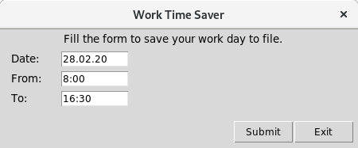

# Work Time Saver

Application created for flextime employees to make **logging** information about **time spent at work** more effortless. 
It saves records to **.txt** file for easy access and manual modification. Simplicity is key. It is designed for any 
kind of users, also those less familiar with computers. After going through quick setup application will be ready to 
**calculate salary** and save **summary** to file after each month of work.

### Features

- adding records with set date, hours (beginning and end) of work
    - to file marked with year from date, e.g. "2020.txt"
    - calculation of time spent at work
    - example record:
    
    
    
- calculation of salary according to:
    - set hour rate
    - overtime rate multiplier
    - number of hours in month after which salary will be multiplied
    - different calculation of tax for normal and overtime hours
    - ability to deduct unpaid break each day after set number of minutes
    
- month summary
    - when month from last record in file is different than set in date
    - sums hours spent at work in previous month (deducting unpaid break when set)
    - calculates month salary (without and with tax if set)
    - exchanges salary to set currency (when specified)
    - example summary:
    
    

##### Author: Adrian Niec
##### This project under the MIT License - see the LICENSE file for details